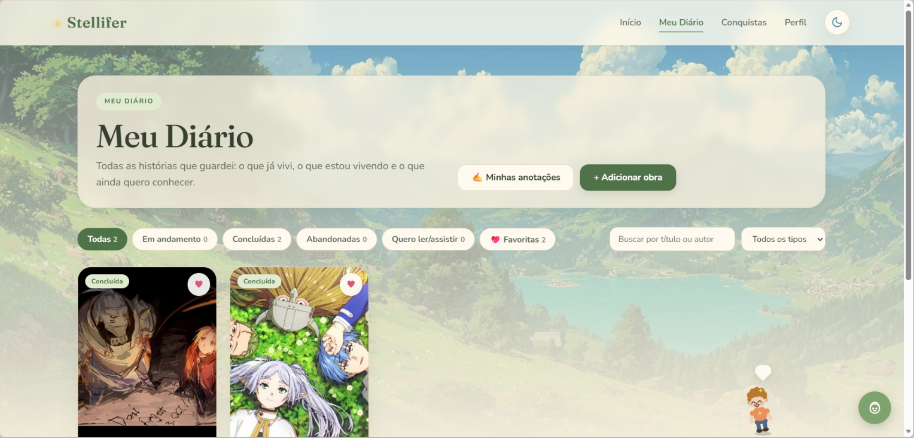
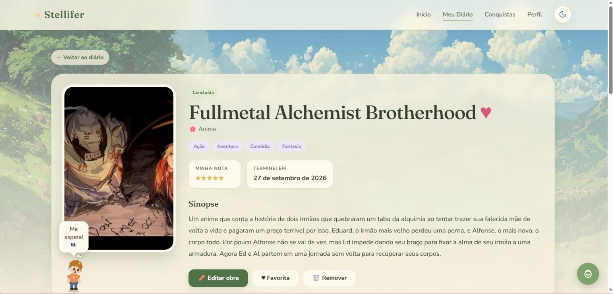
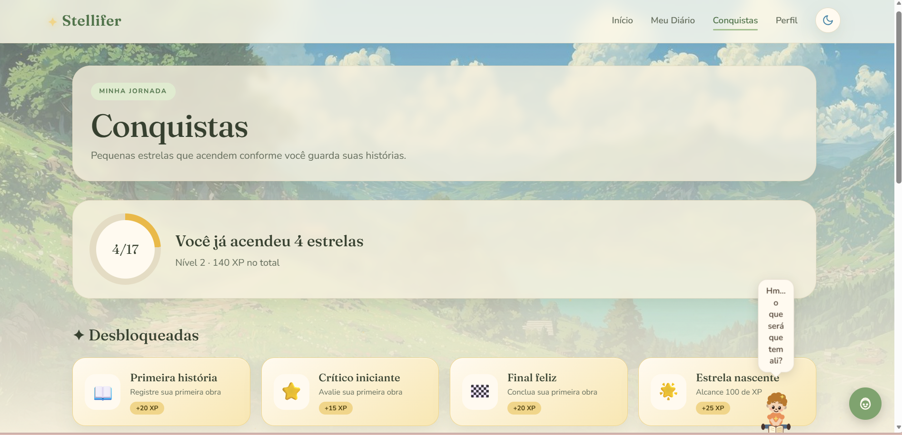
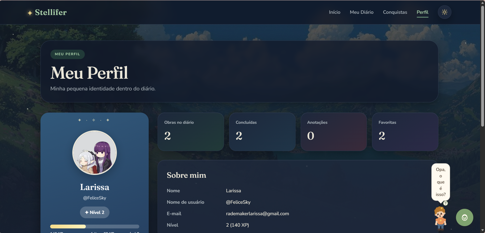
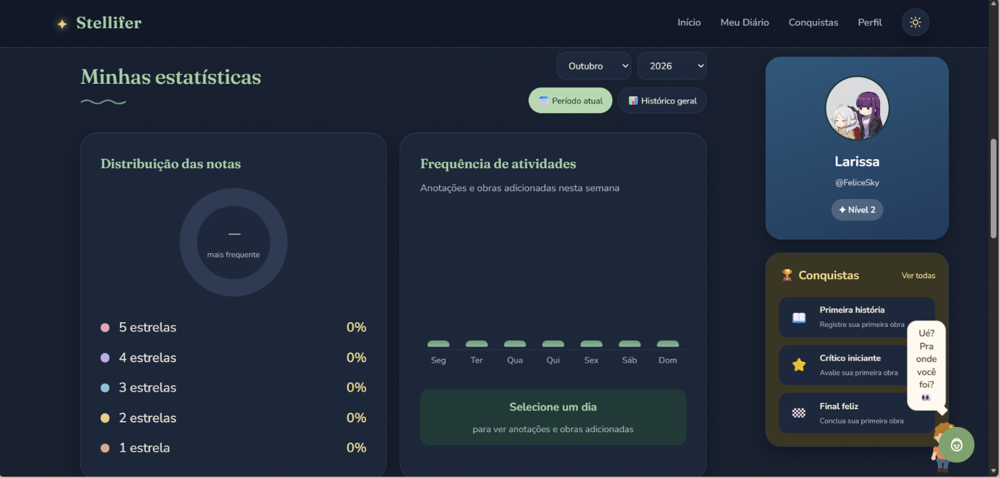
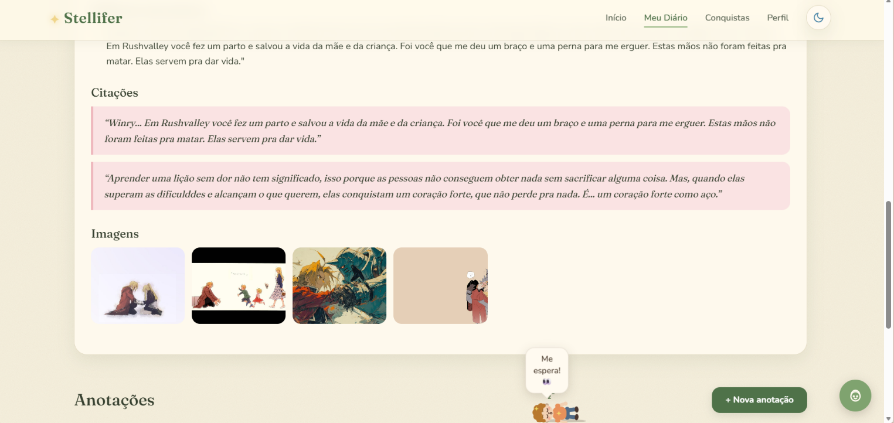
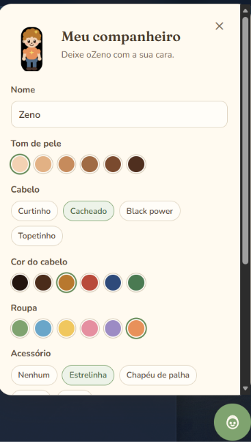

# ✦ Stellifer

> **Seu diário pessoal para guardar as histórias que fizeram parte da sua jornada.**

[🌐 Acessar o Stellifer](https://rademakerlarissa-web.github.io/Stellifer2.0/) • [💻 Ver o código-fonte](https://github.com/rademakerlarissa-web/Stellifer2.0)


O **Stellifer** é uma aplicação web desenvolvida para funcionar como um diário pessoal de obras audiovisuais e literárias.

A proposta é permitir que cada usuário registre e organize histórias que já conheceu, está conhecendo ou ainda deseja conhecer, podendo atribuir avaliações, registrar anotações, guardar citações, marcar favoritos e acompanhar sua própria evolução através de estatísticas e conquistas.

Mais do que um catálogo, o Stellifer foi pensado como um espaço pessoal para guardar memórias relacionadas às histórias que fizeram parte da vida de cada usuário. ✦


---

## ✨ Conheça o Stellifer

O Stellifer possui uma interface inspirada na ideia de um diário pessoal, combinando elementos delicados, ilustrações, estrelas e uma identidade visual inspirada em fantasia e aconchego.

### 📖 Meu Diário

A página principal do diário permite visualizar todas as obras registradas e organizá-las de acordo com seu estado:

- Todas
- Em andamento
- Concluídas
- Abandonadas
- Favoritas

Também é possível pesquisar obras pelo título ou autor e filtrar os resultados por tipo.




### 🎬 Página da obra

Cada obra possui uma página própria com informações detalhadas, incluindo:

- título;
- tipo da obra;
- gêneros;
- sinopse;
- avaliação;
- status;
- data de conclusão;
- indicação de favorita;
- imagens;
- citações;
- anotações.




### 🏆 Conquistas

O Stellifer possui um sistema de conquistas que transforma o registro das obras em uma pequena jornada.

As conquistas são desbloqueadas conforme o usuário utiliza a plataforma e realiza determinadas ações.

Cada conquista pode conceder **XP**, contribuindo para a evolução do nível do usuário.




### 👤 Perfil

O perfil reúne informações pessoais do usuário e um resumo de sua jornada dentro do Stellifer.

Entre as informações apresentadas estão:

- nome;
- nome de usuário;
- e-mail;
- nível;
- XP;
- quantidade de obras;
- obras concluídas;
- anotações;
- obras favoritas.




### 📊 Estatísticas

A página de estatísticas permite visualizar os hábitos do usuário dentro do diário.

Entre as informações apresentadas estão:

- distribuição das avaliações;
- frequência de atividades;
- período atual;
- histórico geral;
- evolução da utilização do diário;
- resumo do perfil;
- conquistas.




### 📝 Anotações e citações

O usuário também pode registrar suas próprias impressões sobre as obras.

É possível guardar:

- anotações pessoais;
- citações marcantes;
- imagens relacionadas à obra.

Dessa forma, o Stellifer funciona não apenas como um catálogo, mas também como um espaço para registrar as experiências e lembranças associadas a cada história.




### 🧸 Seu companheiro

Um dos elementos especiais do Stellifer é o pequeno companheiro que acompanha o usuário durante sua jornada.

O personagem pode ser personalizado através de diferentes opções de:

- nome;
- tom de pele;
- cabelo;
- cor do cabelo;
- roupa;
- acessórios.

O companheiro também aparece em diferentes partes da interface, trazendo pequenas interações e ajudando a criar uma identidade mais pessoal para cada usuário.




---

## 🌟 Principais funcionalidades

### 📚 Diário pessoal

- Cadastro de obras.
- Organização das obras por status.
- Busca por título ou autor.
- Filtros por tipo.
- Sistema de favoritos.
- Página individual para cada obra.

### ⭐ Avaliações

- Avaliação de 1 a 5 estrelas.
- Visualização das avaliações.
- Distribuição das notas nas estatísticas.

### 📝 Registros pessoais

- Anotações sobre as obras.
- Citações favoritas.
- Imagens relacionadas às histórias.
- Registro da experiência pessoal com cada obra.

### 🏆 Gamificação

- Sistema de XP.
- Níveis do usuário.
- Conquistas desbloqueáveis.
- Recompensas por ações realizadas dentro do diário.

### 📊 Estatísticas

- Distribuição das avaliações.
- Frequência de atividades.
- Períodos de análise.
- Histórico geral.
- Resumo da atividade do usuário.

### 👤 Perfil

- Informações do usuário.
- Foto de perfil.
- Nome de usuário.
- Nível e XP.
- Resumo da utilização do diário.

### 🎨 Personalização

- Tema claro e escuro.
- Interface inspirada em um diário.
- Companheiro personalizável.
- Elementos visuais e animações para tornar a experiência mais agradável.


---

## 🔐 Autenticação

O Stellifer possui sistema de autenticação para separar os dados de cada usuário.

O sistema contempla:

- cadastro;
- login;
- identificação do usuário;
- acesso às informações pessoais;
- proteção das funcionalidades relacionadas ao perfil;
- armazenamento das credenciais através de variáveis de ambiente.

As informações sensíveis de configuração do banco de dados são mantidas em um arquivo `.env`, que não faz parte do repositório público.


---

## 🛠️ Tecnologias utilizadas

### Front-end

- HTML5
- CSS3
- JavaScript

### Back-end

- Node.js
- Express

### Banco de dados

- MySQL

### Desenvolvimento

- Visual Studio Code
- Git
- GitHub

A aplicação foi desenvolvida utilizando JavaScript tanto no front-end quanto no back-end, com Node.js e Express responsáveis pela comunicação entre a aplicação e o banco de dados MySQL.


---

## 🗄️ Banco de dados

O Stellifer utiliza um banco de dados relacional desenvolvido em MySQL.

O modelo foi pensado para representar os principais elementos da aplicação, incluindo:

- usuários;
- diários;
- obras;
- itens do diário;
- avaliações;
- relacionamentos entre usuários e suas obras.

As relações entre entidades são representadas através de estruturas relacionais e tabelas intermediárias quando necessário, evitando a duplicação de informações e mantendo a organização dos dados.


---

## 🧩 Estrutura do projeto

A estrutura geral do projeto é organizada de forma a separar os arquivos da interface, scripts, imagens, servidor e documentação.

```text
Stellifer2.0/
│
├── css/
│   ├── ...
│   └── ...
│
├── js/
│   ├── ...
│   └── ...
│
├── imagens/
│   ├── ...
│   └── ...
│
├── docs/
│   └── screenshots/
│       ├── diario.png
│       ├── obra.png
│       ├── conquistas.png
│       ├── perfil.png
│       ├── estatisticas.png
│       ├── anotacoes.png
│       └── companheiro.png
│
├── server.js
├── package.json
├── .env
├── .gitignore
└── README.md